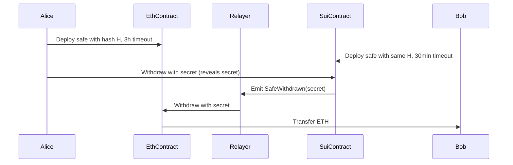

# Fusion+ Cross-Chain Swap Protocol# Cross-Chain Safe Escrow System


A gasless, intent-based cross-chain swap protocol enabling atomic swaps between Ethereum and Sui networks with competitive resolver execution.A comprehensive cross-chain safe escrow system between **Ethereum** and **Sui** networks using hash-locked time contracts (HTLCs) with dual hash support (keccak256 and sha256) for maximum compatibility.


## Quick Start## 🌟 Features


1. **Setup Environment**:- **Cross-chain atomic swaps** between Ethereum and Sui

   ```bash- **Dual hash support**: keccak256 (Ethereum native) and sha256 (cross-chain compatible)

   npm install- **Constructor initialization**: Secret hash set during deployment for security

   cp .env.example .env- **Automated relayer system** for seamless cross-chain operations

   ```- **Timeout safety mechanisms** with configurable timeouts

- **Gas-optimized contracts** with proper access controls

2. **Start Local Chains**:- **Comprehensive monitoring** and alerting system

   ```bash

   # Terminal 1 - Ethereum (Anvil)## 🏗️ Architecture

   anvil --host 0.0.0.0

### Core Components

   # Terminal 2 - Sui Local Network

   sui start --with-faucet --force-regenesis1. **HashUtility**: Consistent hashing functions across chains

   ```2. **SafeEscrow**: Individual escrow contracts holding funds

3. **SafeRecord**: Registry contracts for cross-chain coordination

3. **Deploy Contracts**:4. **RelayerService**: Automated cross-chain operation monitoring

   ```bash5. **CrossChainEscrowManager**: Main orchestration layer

   npm run deploy:dev

   ```### Supported Networks


4. **Start Services**:- **Ethereum**: Mainnet, Sepolia, Goerli

   ```bash- **Sui**: Mainnet, Testnet, Devnet

   # Terminal 3 - Orderbook

   npm run orderbook## 🚀 Quick Start


   # Terminal 4 - Resolver### 🎯 Try the Mock Demo (No Setup Required)

   npm run resolver

Experience the complete cross-chain resolution flow with our interactive mock demo:

   # Terminal 5 - Frontend

   npm run frontend```bash

   ```# Run the complete ETH ↔ SUI cross-chain demo

node examples/eth-sui-mock-demo.js

## Architecture

# Or run the Jest-based mock tests

- **Ethereum Contracts**: Foundry-based escrow and staking contractsnpm test -- test/eth-sui-mock.test.js

- **Sui Modules**: Move-based escrow and staking modules```

- **Orderbook Service**: Intent management and auction coordination

- **Resolver Service**: Automated market making and swap execution**What the demo shows:**

- **Frontend**: React app for user interactions- Alice wants 100 SUI tokens and offers 1 ETH

- Bob (resolver) provides the 100 SUI and receives the 1 ETH

## Components- Complete atomic swap using hash-locked time contracts (HTLC)

- Secret reveal mechanism ensures trustless exchange

- `packages/contracts/` - Ethereum Foundry contracts- Timeout protection prevents fund loss

- `packages/sui-modules/` - Sui Move modules

- `packages/orderbook/` - Express.js orderbook serviceThe demo simulates the entire flow including:

- `packages/resolver/` - TypeScript resolver service1. ✅ Requester creates Ethereum escrow (Alice locks 1 ETH)

- `packages/frontend/` - React frontend application2. ✅ Resolver creates Sui escrow (Bob locks 100 SUI)  

3. ✅ Requester withdraws SUI by revealing secret

Built with ❤️ by the Fusion+ team4. ✅ Resolver uses revealed secret to claim ETH
5. ✅ Both parties receive their desired tokens atomically

### Prerequisites (For Real Blockchain Integration)

- Node.js 18+
- Foundry (for Ethereum contracts)
- Sui CLI (for Sui contracts)

### Installation

```bash
# Clone the repository
git clone <repository-url>
cd cross-chain-safe-escrow

# Install dependencies
npm install

# Copy environment configuration
cp .env.example .env

# Edit .env with your configuration
nano .env
```

### Deploy Contracts

#### Ethereum (using Foundry)

```bash
cd contracts/ethereum

# Install Foundry dependencies
forge install

# Deploy to testnet
forge script script/Deploy.s.sol --rpc-url $SEPOLIA_RPC_URL --private-key $PRIVATE_KEY --broadcast --verify
```

#### Sui (using Sui CLI)

```bash
cd contracts/sui

# Build the package
sui move build

# Deploy to devnet
sui client publish --gas-budget 100000000
```

### Run the System

```bash
# Start the main application with relayer
npm start

# Or run just the relayer
npm run relayer

# Run examples
node examples/usage-examples.js
```

## 📋 Usage Examples

### Cross-Chain Swap (ETH ↔ SUI)

```javascript
import { CrossChainEscrowManager } from './src/core/CrossChainEscrowManager.js';
import { HashUtility } from './src/utils/HashUtility.js';

const hashUtility = new HashUtility();
const escrowManager = new CrossChainEscrowManager(config);

await escrowManager.initialize();

// Create cross-chain safe pair
const secret = hashUtility.generateRandomSecret();
const crossChainSafe = await escrowManager.createCrossChainSafe({
    secret: secret,
    sourceChain: 'ethereum',
    destChain: 'sui',
    sourceToken: '0xUSDC_ADDRESS',
    destToken: '0x2::sui::SUI',
    sourceAmount: '100000000', // 100 USDC
    destAmount: '100000000000', // 100 SUI
    sourceOwner: 'alice_address',
    destOwner: 'bob_address',
    sourceLockDuration: 3 * 60 * 60 * 1000, // 3 hours
    destLockDuration: 30 * 60 * 1000 // 30 minutes
});

// Alice withdraws SUI by revealing secret
await escrowManager.withdrawFromSafe('sui', crossChainSafe.destSafe.id, secret);
// Relayer automatically withdraws ETH for Bob
```

### Single-Chain Safe

```javascript
// Create single-chain safe on Ethereum
const ethSafe = await escrowManager.createSingleChainSafe({
    chain: 'ethereum',
    secret: 'my-secret',
    token: '0xUSDT_ADDRESS',
    amount: '50000000', // 50 USDT
    beneficiary: 'beneficiary_address',
    lockDuration: 24 * 60 * 60 * 1000, // 24 hours
    useKeccak256: true // Gas efficient
});
```

## 🔧 Configuration

### Environment Variables

```bash
# Ethereum Configuration
ETH_RPC_URL=https://sepolia.infura.io/v3/YOUR_PROJECT_ID
ETH_PRIVATE_KEY=0x...
ETH_SAFE_RECORD_ADDRESS=0x...

# Sui Configuration
SUI_RPC_URL=https://fullnode.devnet.sui.io:443
SUI_PRIVATE_KEY=...
SUI_PACKAGE_ID=0x...
SUI_REGISTRY_ID=0x...

# Relayer Configuration
RELAYER_ENABLED=true
RELAYER_RETRY_ATTEMPTS=3

# Network Configuration
NETWORK=testnet
```

### Timeout Configuration

- **Mainnet**: Source = 3 hours, Destination = 30 minutes
- **Testnet**: Source = 30 minutes, Destination = 5 minutes  
- **Devnet**: Source = 10 minutes, Destination = 2 minutes

## 🔒 Security Features

### Hash Consistency
- **Cross-chain swaps**: MUST use sha256 consistently
- **Single-chain operations**: Can use keccak256 for gas efficiency
- **Verification**: Both hashing methods supported

### Timeout Strategy  
- **Source timeout > Destination timeout + safety margin**
- **Automatic refunds** after timeout expiration
- **Network-specific defaults** for optimal safety

### Access Control
- **Permissionless withdrawals** with correct secret
- **Owner-only refunds** after timeout
- **Registry management** with proper authorization

## 🤖 Relayer System

The relayer automatically monitors both chains and triggers cross-chain operations:

```javascript
// Automatic operation when Alice withdraws SUI
1. Alice reveals secret on Sui → SafeWithdrawn event
2. Relayer detects event → Extracts secret
3. Relayer calls withdraw on Ethereum → Bob receives ETH
4. Cross-chain swap completed atomically
```

### Relayer Features
- **Stateless operation** (no database required)
- **Multi-instance safe** (multiple relayers can run)
- **Retry mechanisms** with exponential backoff
- **Gas optimization** and batch operations

## 📊 Monitoring & Analytics

### Event Tracking
- SafeCreated, SafeWithdrawn, SafeRefunded events
- Cross-chain swap success rates
- Relayer performance metrics

### Alerting
- Failed cross-chain operations
- Unusual timeout patterns
- High-value transaction monitoring

## 🧪 Testing

### Unit Tests

```bash
# Ethereum contracts (Foundry)
cd contracts/ethereum
forge test -vvv

# JavaScript tests
npm test
```

### Integration Tests

```bash
# Run full integration test suite
npm run test:integration
```

## 📁 Project Structure

```
├── contracts/
│   ├── ethereum/          # Foundry project for Ethereum
│   │   ├── src/           # Solidity contracts
│   │   ├── test/          # Contract tests
│   │   └── script/        # Deployment scripts
│   └── sui/               # Move project for Sui
│       └── sources/       # Move modules
├── src/
│   ├── core/              # Core business logic
│   ├── relayer/           # Cross-chain relayer
│   └── utils/             # Utility functions
├── examples/              # Usage examples
└── docs/                  # Additional documentation
```

## 🔄 Cross-Chain Flow



## 🛠️ Development

### Adding New Chains

1. Implement chain-specific manager (extend base class)
2. Add chain configuration to ConfigManager
3. Update CrossChainEscrowManager routing
4. Add relayer event listeners
5. Update documentation

### Custom Hash Functions

```javascript
// Extend HashUtility for custom hashing
class CustomHashUtility extends HashUtility {
    customHash(input) {
        // Your custom hashing logic
        return crypto.createHash('blake2b512').update(input).digest();
    }
}
```

## 📄 License

MIT License - see LICENSE file for details

## 🤝 Contributing

1. Fork the repository
2. Create your feature branch (`git checkout -b feature/amazing-feature`)
3. Commit your changes (`git commit -m 'Add amazing feature'`)
4. Push to the branch (`git push origin feature/amazing-feature`)
5. Open a Pull Request

## 📞 Support

- GitHub Issues: Report bugs and request features
- Documentation: See `/docs` folder for detailed guides
- Examples: Check `/examples` for usage patterns

---

*Built with ❤️ for the multi-chain future*


-- Relayer private key = 
